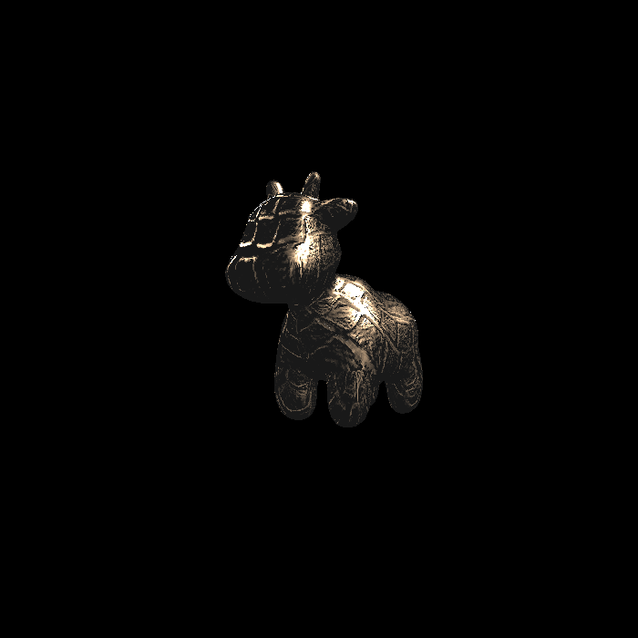

# Assignment3

## Prerequisite

```bash
$ vcpkg install eigen3
$ vcpkg install opencv4
```

## Modifications

**main.cpp** 

`Eigen::Matrix4f get_projection_matrix()`

实现透视投影（来自作业1）

`Eigen::Vector3f phong_fragment_shader(const fragment_shader_payload& payload)`

实现 Blinn-Phong Reflection Model

`Eigen::Vector3f texture_fragment_shader(const fragment_shader_payload& payload)`

实现 Texture Shading Fragment Shader

`Eigen::Vector3f bump_fragment_shader(const fragment_shader_payload& payload)`

实现 Bump Fragment Shader

`Eigen::Vector3f displacement_fragment_shader(const fragment_shader_payload& payload)`

实现 Displacement Fragment Shader

**raterizer.cpp** 

`std::tuple<float, float, float, float> rst::rasterizer::get_bounding_box(const Triangle& t)`

求出三角形的二维包围盒，[x_min, y_min, x_max, y_max] 顺序（来自作业2，有改动）

`void rst::rasterizer::rasterize_triangle(const Triangle& t)`

类似作业2，额外完成了对各属性的差值，设置到payload，并执行执行的shader，将结果设置到frame buffer中

## Result

### Normal Shader


### Phong Fragment Shader


### Texture Fragment Shader


### Bump Fragment Shader


### Displacement Fragment Shader

