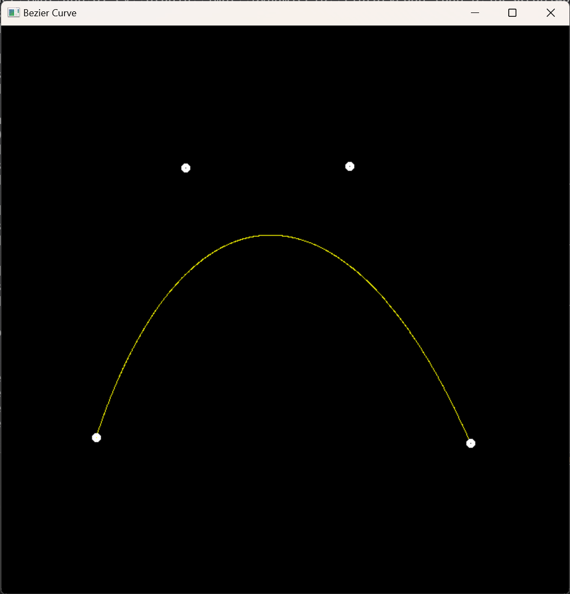

# Assignment4

## Modifications

**main.cpp** 

`cv::Point2f recursive_bezier(const std::vector<cv::Point2f> &control_points, float t) `

实现 **de Casteljau** 算法

`void bezier(const std::vector<cv::Point2f> &control_points, cv::Mat &window) `

调用 **recursive_bezier** 方法根据控制点序列获得最终目标点进行绘制

`void antialiasing_bezier(const std::vector<cv::Point2f>& control_points, cv::Mat& window)`

对 **recursive_bezier** 获得最终目标点绘制过程进行反走样处理

## Result

### Bezier

### Antialiasing Bezier

