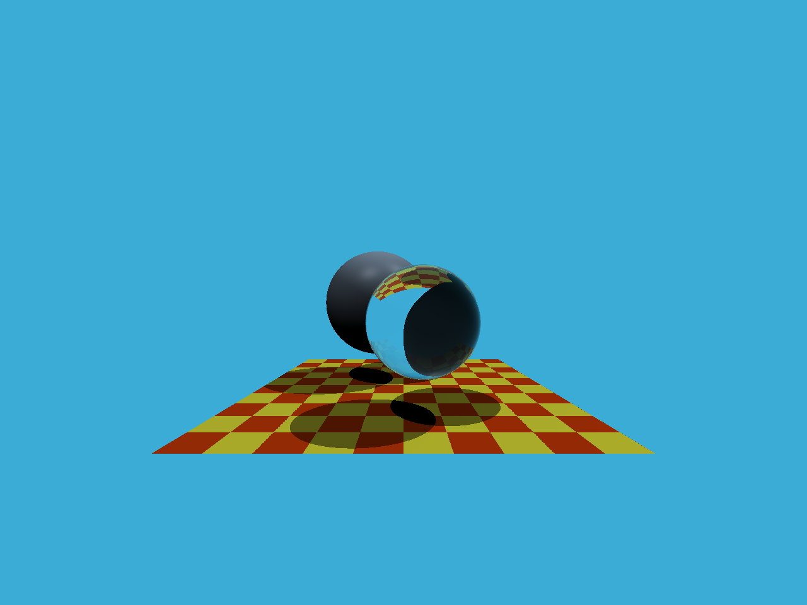

# Assignment5

## Modifications

**Renderer.cpp** 

`void Renderer::Render(const Scene& scene)`

由 Screen Space 坐标转换为 View Space 坐标，得到 ray 的入射方向 dir

**Triangle.hpp**

`bool rayTriangleIntersect(const Vector3f& v0, const Vector3f& v1...)`

实现 Möller–Trumbore 算法，返回 tnear, u, v 结果，修正浮点数误差导致的地面蓝色像素点

## Result

### With Artifacts

虽然不明显但可以看到左上方的地面阴影中存在蓝色像素点

### Fixed

