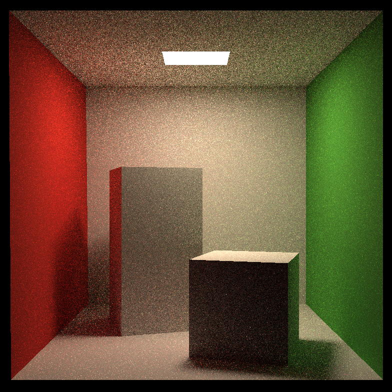
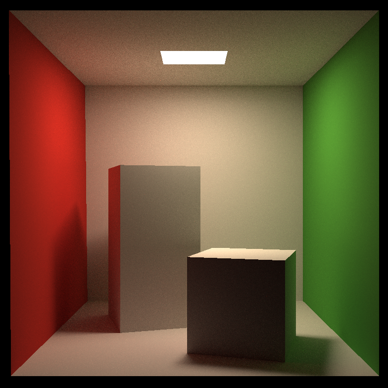

# Assignment7

## Modifications

### Triangle.hpp

`Intersection Triangle::getIntersection(Ray ray)`

Möller–Trumbore 算法在框架中已基本完成，通过计算结果 `t_tmp`, `u`, `v` 构建 Intersection 实例返回即可，在作业6基础上存在修改

### Bounds3.hpp

`bool Bounds3::IntersectP(const Ray& ray, const Vector3f& invDir, const std::array<bool, 3>& dirIsPositive)`

完成判断包围盒 BoundingBox 与光线是否相交的算法，在作业6基础上存在修改

### BVH.cpp

`Intersection BVHAccel::getIntersection(BVHBuildNode* node, const Ray& ray)`

完成判断光线与BVH各节点，及其中内容是否相交的递归过程

### Scene.cpp

`Vector3f Scene::shade(Intersection& hit_obj, Vector3f wo) const`

于 `Vector3f Scene::castRay(const Ray &ray, int depth) const` 中调用，实现 Path Tracing 算法

## Result

单线程执行，SPP16，耗时 21 minutes 29 seconds，输出结果如下

进行多线程优化，在 Intel i9-10900KF CPU @ 3.70GHz 10 Cores 20 Threads，SPP16，Release Build 运行环境下耗时 17 seconds，运行时长优化效果显著

相同运行环境下提升SPP，SPP64 耗时 71 seconds

SPP256 耗时 278 seconds

SPP512 耗时 568 seconds，已可以得到较理想的输出

SPP1024 耗时 1108 seconds，相较 SPP512 差异不大

